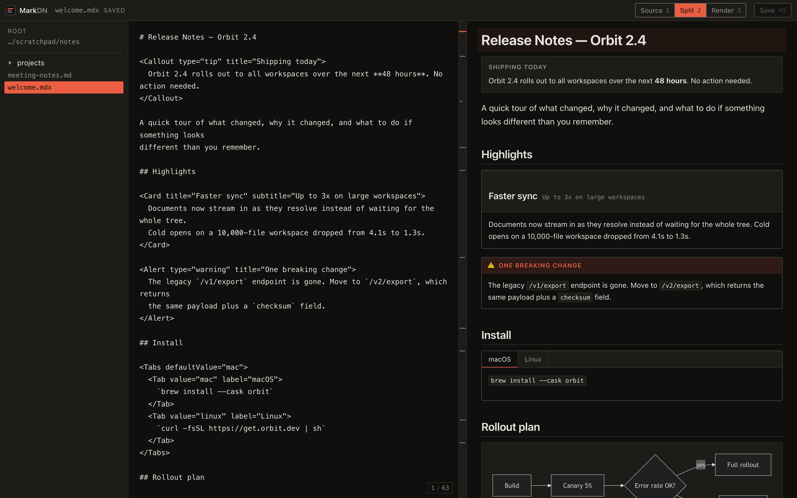
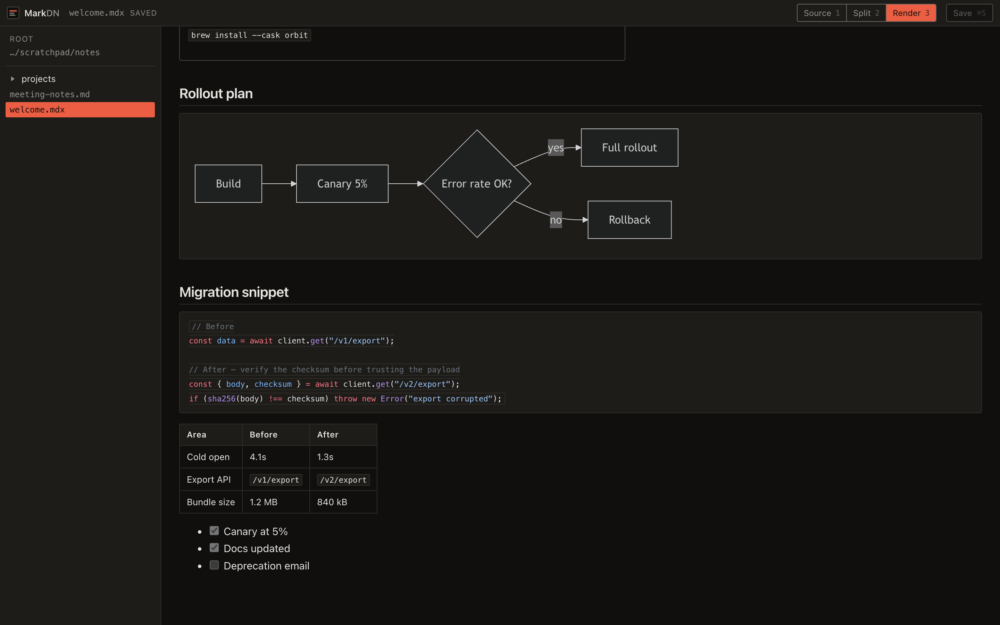
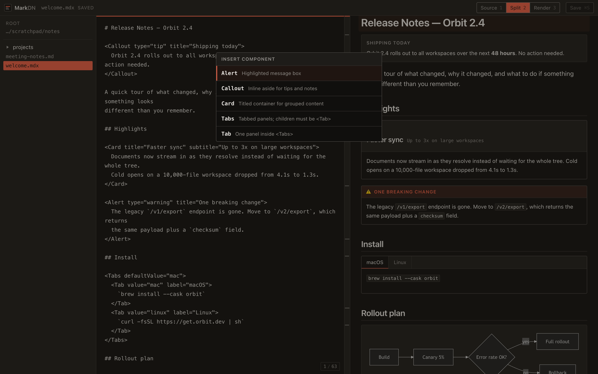

# MarkDN

A native markdown and MDX editor for your notes folder. Write on the left, see
it rendered on the right — diagrams, syntax highlighting, and real components
included. Your files stay plain markdown on your disk.



## Install

**macOS — Homebrew**

```bash
brew tap filipecabaco/markdn https://github.com/filipecabaco/markdn
brew install --cask markdn
```

**macOS and Linux — one line**

```bash
curl -fsSL https://raw.githubusercontent.com/filipecabaco/markdn/main/install.sh | sh
```

MarkDN currently ships unsigned, so the installer clears the macOS quarantine
flag for you — otherwise Gatekeeper refuses to open it.

## What it does

**Split, source, or render.** Three views, one keystroke apart — `1`, `2`, `3`.
The panes scroll together by block, so a three-line diagram and its full-size
render stay side by side.

**Everything markdown, plus the good parts.** Tables, task lists, and
strikethrough. Code fences highlighted properly. ` ```mermaid ` blocks drawn as
real diagrams.



**Components that actually render.** Drop an `<Alert>`, `<Callout>`, `<Card>`,
or `<Tabs>` into a document and it appears in the preview as you type. Hit
`Cmd/Ctrl+Shift+C` to pick one from a menu instead of typing JSX by hand.



**Your folder, your files.** Point MarkDN at a directory and it browses it.
Nothing is imported, converted, or locked in a database — `Cmd/Ctrl+S` writes
plain text back to the same `.md`, `.markdown`, or `.mdx` file.

**Open to your AI tools.** MarkDN speaks MCP, so Claude and other assistants can
list, read, and write your documents. Edits made by an assistant show up in an
open window immediately.

**Private by default.** Everything runs locally on your machine. Nothing leaves
your computer, and MDX is rendered — never executed.

## Using it

| | |
| --- | --- |
| `1` `2` `3` | Source, split, render |
| `Cmd/Ctrl+S` | Save |
| `Cmd/Ctrl+Shift+C` | Insert a component |

Components available today: `Alert`, `Callout`, `Card`, `Tabs`, `Tab`.

## Connecting an AI assistant

Point any MCP client at MarkDN while it is running:

```
http://localhost:43118/mcp
```

It exposes four tools — `list_documents`, `read_document`, `write_document`,
and `list_components`.

## Contributing

Building from source, the desktop packaging, CI, and release process are
documented in [docs/DEVELOPMENT.md](docs/DEVELOPMENT.md).
